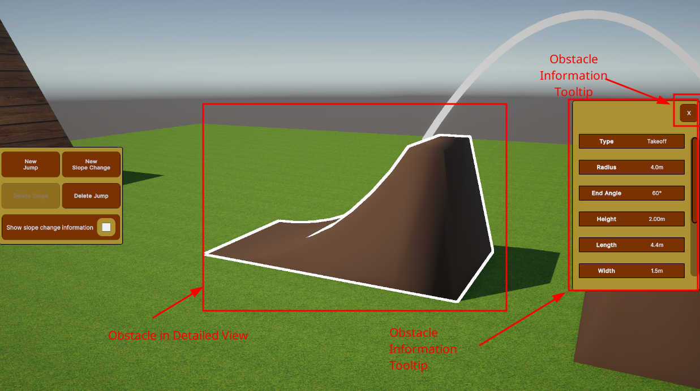
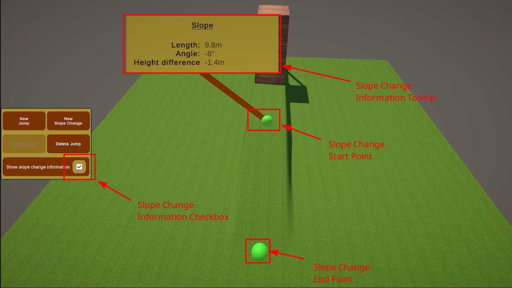
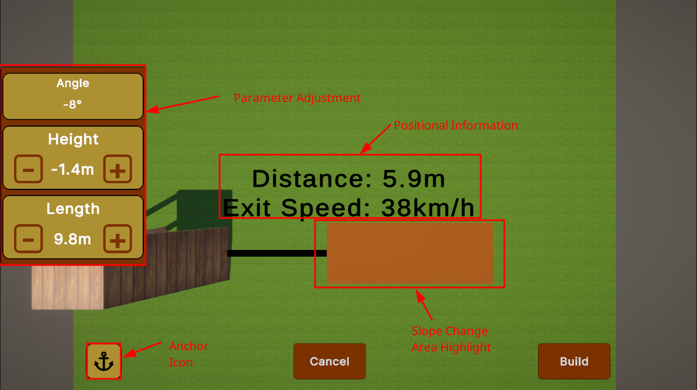
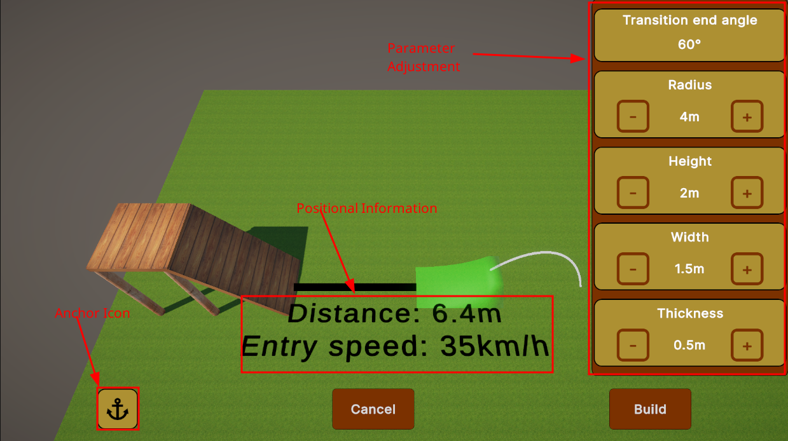
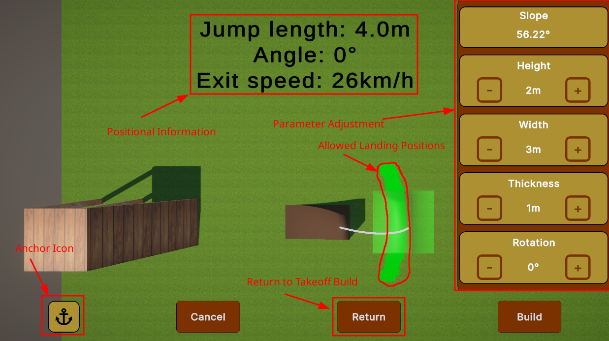
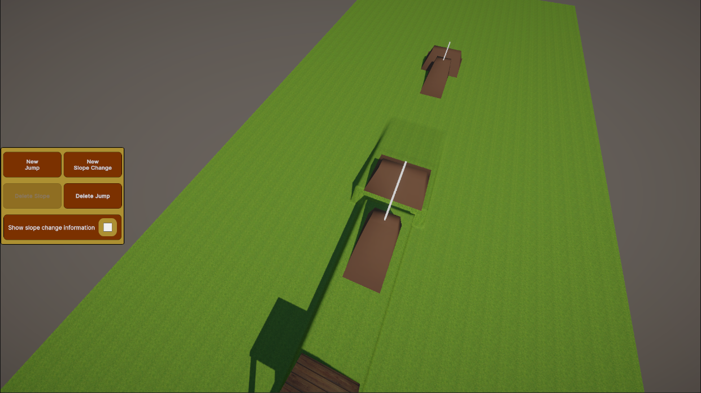
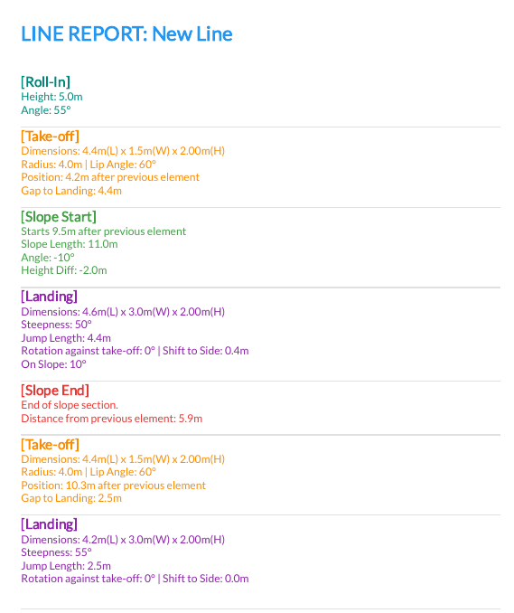

# Trails Studio

Trails Studio is an application that allows users to design BMX dirt jump courses in a 3D visualized environment.

## Installation

1. Navigate to the project's GitHub Releases page.
2. Download the latest zipped build folder.
3. Extract the contents to your preferred directory.
4. To run Trails Studio, run the `TrailsStudio.exe` binary. You will be taken to the main menu.

## Main Menu

In the main menu, you have multiple buttons available:
* **New Line**: Opens the Line Initialization window where you can input the name of the line and parameters of its roll-in. If the calculated exit speed is sufficient, clicking 'Build' takes you to the Studio.
* **Load Line**: Opens a window with all present saves listed. Select an existing save and press 'Load' to enter the Studio, or delete saves as needed.
* **Settings**: Allows you to adjust module-specific application settings. Reckless use of settings can break the application, but a 'Restore Defaults' button is available.

## Studio Usage

After entering the Studio, you are presented with a view of the line and a sidebar containing building and deleting tools.

### Camera Control
* The default view of the Studio can be moved around along a path on top of the line.
* Use the **WASD** keys to move around relative to the direction you are looking.
* Click and hold the **right mouse button** and drag to change your looking direction.

### Examining Elements
* **Obstacles**: Click on an obstacle to view it from any direction (holding right-click to drag) and see an information tooltip with its parameter values.
  
  

* **Slope Changes**: Check the "Show slope change information" checkbox in the sidebar to display start and end points (green spheres) and information tooltips for all present slope changes.
  
  

### Position and Build Controls

Clicking "New Jump" or "New Slope Change" switches the application to a position & build state with a top-down view.
* **Anchoring**: The application moves the object based on your mouse input. Press the **left mouse button** to anchor the positioned object in place so you can adjust parameters without moving it. An anchor icon will appear in the bottom left corner.
* **Slope Change**: Move the mouse to position the start of the slope change and adjust its length and height difference to affect the exit speed.
  
  

* **Takeoff**: Control the takeoff's position with the mouse, and adjust defining parameters (radius, height) as well as cosmetic parameters (width, thickness). Click 'Build' to move to the landing.
  
  

* **Landing**: The application calculates viable positions and slopes. Hover over a position to switch to it, adjust height and rotation, and click 'Build' to finish the jump.
  
  

### Deleting Elements
* **Delete Jump**: Press the "Delete Jump" button and hover over obstacles to enter delete mode. A green highlight indicates it can be deleted (generally only the last obstacle in the line). Deleting a takeoff also deletes its landing.
* **Delete Slope**: Only untouched slope changes (with no obstacles built on or after them) can be deleted via the "Delete Slope" button.

### Generating PDF Reports

Trails Studio offers the ability to generate a PDF document containing the textual representation of the designed line, which is useful for real-world building.
* Press the **Escape** key to open the escape menu.
* Click **Save Textual Representation** to open a file explorer and choose the save location.
  
  
  
  
